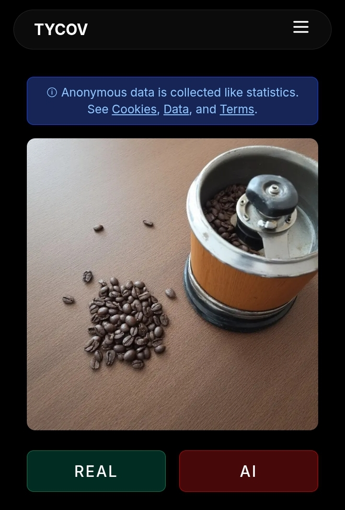

# Summary

Advances in generative AI have made it increasingly difficult for humans to reliably distinguish between AI-generated and real images. This shift raises important questions about human perception, trust, and decision-making in digital environments.  

**TYCOV (Test Your Cognitive Vision)** is an open-source web application designed to facilitate reproducible experiments in this space. The platform enables researchers and the public to explore how well humans identify AI-generated versus real images in a controlled, scalable, and anonymous manner.

TYCOV is not only an application but also a framework for **reproducible human–computer interaction (HCI) and AI perception studies**, supporting ethical experimentation, transparent data collection, and reproducible analysis.

# Statement of Need

While numerous studies investigate how people perceive AI-generated content, few provide **open, reusable software infrastructure** that others can adapt for their own research. Most existing works are either closed prototypes or narrowly tailored to specific datasets.  

TYCOV addresses this gap by providing:

- A fully open-source **web-based platform** (Next.js + Tailwind CSS) for image-based cognitive experiments.
- Anonymized data collection with no personally identifiable information (PII).
- Integration with **Supabase** and schema management via **Drizzle ORM** for reproducibility.
- A transparent pipeline for including new datasets (AI-generated and real images).
- Built-in consent workflows for ethical experimentation.

This makes TYCOV valuable not just as a one-off experiment, but as a **generalizable tool** for HCI, AI perception, and digital cognition research.

# Implementation

The software stack includes:

- **Frontend**: Next.js (React framework) with Tailwind CSS for responsive, mobile-friendly UI.  
- **Backend/Database**: Supabase (PostgreSQL) with Drizzle ORM for schema migrations and queries.  
- **Deployment**: Supports both local development and cloud deployment with environment variables for Supabase integration.  
- **Data Pipeline**:  
  - Images organized into categories (real vs AI-generated).  
  - Dataset manifest auto-generated (`manifest.json`).  
  - Responses stored in the `responses` table.  
  - Aggregated statistics stored in the `stats` table.  

Images for the reference implementation were generated using **Stable Diffusion XL (SDXL)** [@podell2023sdxl] and **Flux.1 Schnell** [@flux2024schnell].

# Reproducibility

To ensure reproducibility, the project provides:

1. **Open-source code** under the MIT License.  
2. **Sample dataset** of 10 rows of data included in README.md for testing and reproducibility.  
3. **Clear schema definition** for Supabase tables (`responses`, `stats`).  
4. **Step-by-step documentation** for installation, dataset integration, and deployment.  

This ensures that other researchers can replicate the experimental setup, swap in new datasets, and run independent studies.

# Acknowledgements

The author thanks the participants who engaged with TYCOV during its deployment period and the open-source community for supporting reproducible research practices.

# References
